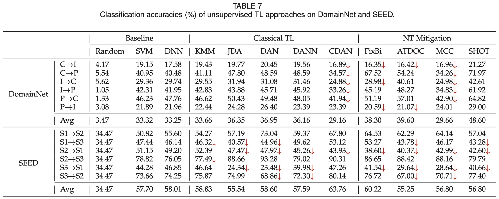

# Benchmark of negative transfer

[](LICENSE)
[](https://github.com/chamwen/NT-Benchmark/commits/main)

NT represents that introducing source domain data/knowledge decreases the learning performance in the target domain, which is a long-standing and challenging issue in TL. 

This repository contains codes of negative transfer (NT) detection experiments with over 20 representative approaches on three NT-specific datasets.


## Datasets

There are three NT-specific datasets with large domain shift, i.e., on one synthetic dataset, and two real-world datasets on object recognition and emotion recognition. Their statistics are summarized below:

<div align="center">
    
</div>


## Running the code

The code is mainly based on Python 3.8 and PyTorch 1.8. 

Code files introduction:

**NT_UDA/** -- NT detection experiments on 12 unsupervised domain adaptation approaches

**NT_SSDA/** -- NT detection experiments on 11 semi-supervised domain adaptation approaches

**NT_Noise/** -- NT detection experiments under source label noise

Specifically, take NT-UDA for example, the procedure is

1. Initialize the networks involved in the experiments to ensure fair comparisons by

   ```python
   python save_init_model.py
   ```

2. Run the script of a particular approach on a specific dataset

   ```python
   python demo_img_dnn.py
   ```

   

## Benchmark

For **unsupervised TL** on DomainNet and SEED datasets:

<div align="center">
    
</div>


For **semi-supervised TL** on DomainNet and SEED datasets:

<div align="center">
    
</div>